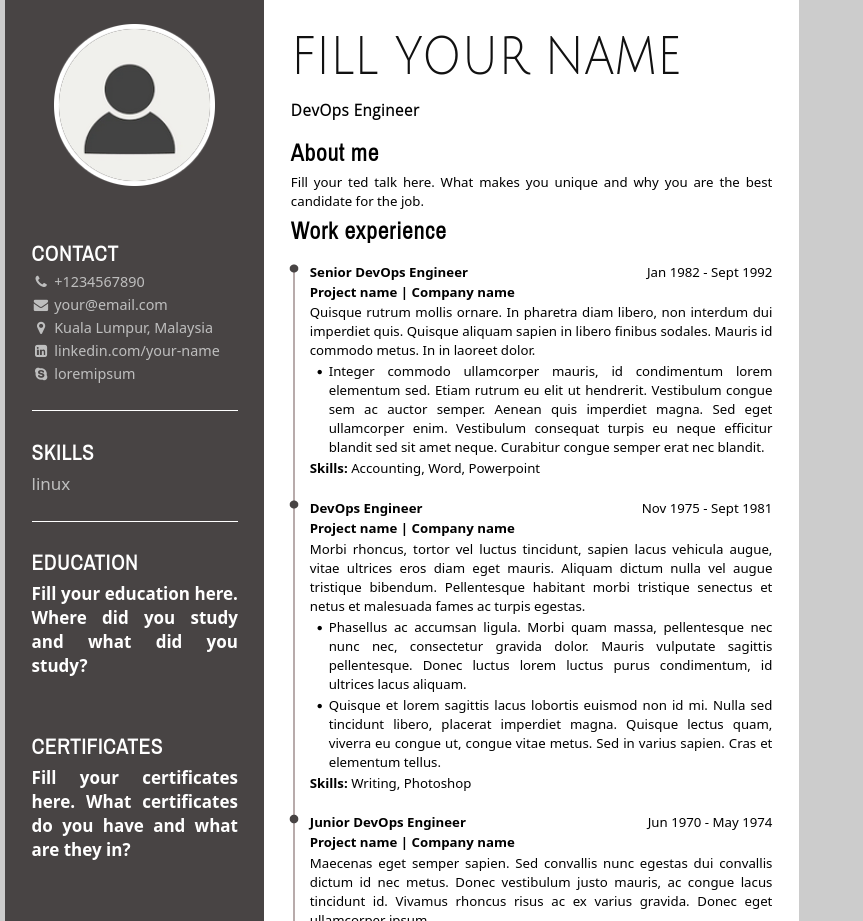

# CV filler

Copy paste any job description (e.g. from LinkedIn etc.) to a text file. Fill your personal skill list. The application compares the job description with your skill list, creates a intersection list of the two and generates rest of the CV as a PDF with tailored skills section.

In addition, a list of static skills that are always included in the Skills section is configurable.

Optimize your chances against ATS systems that scan skills.

Javascript is used to convert the initial html file to a PDF. Golang lacks sufficient tooling to do this, and it is trivial and fast in JS.




### (Optional) Install Node.js via NVM

[https://github.com/nvm-sh/nvm](https://github.com/nvm-sh/nvm)


`curl -o- https://raw.githubusercontent.com/nvm-sh/nvm/v0.39.7/install.sh | bash`

```
export NVM_DIR="$([ -z "${XDG_CONFIG_HOME-}" ] && printf %s "${HOME}/.nvm" || printf %s "${XDG_CONFIG_HOME}/nvm")"
[ -s "$NVM_DIR/nvm.sh" ] && \. "$NVM_DIR/nvm.sh" # This loads nvm
```

`nvm install node`

`nvm use node`


### Initialize npm

`cd js && npm init -y`

`npm install puppeteer`


### Configure the inputs

Copy paste any job description to `jdskills.txt`.

Fill `config.yaml` with your personal information.

### Run the program

In the main directory, execute following commands:

`go mod tidy`

`go run main.go`

Output should be output.html and output.pdf, that contains skills that are common (intersection) in both your skills (`config.yaml`) and `jdskills.txt`.

### Creds

HTML/CSS layout based on [https://gist.github.com/Iftimie/2e358c4720d6d790c837bf01ac6b4b54](https://gist.github.com/Iftimie/2e358c4720d6d790c837bf01ac6b4b54)
